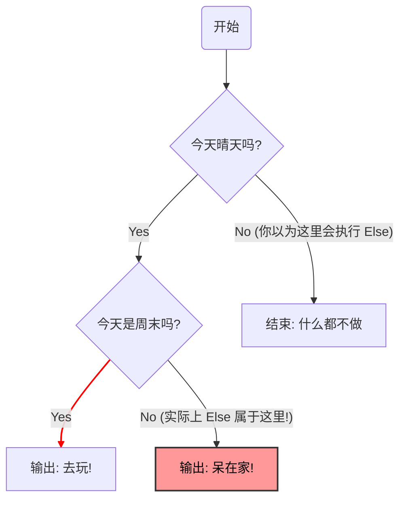

---
tags:
  - C语言
  - 分支语句
时间: 2026-02-09T11:13:00
---
# 前言

> “C语言是一把锋利的剃刀，用好了能刮出最帅的发型，用不好……很容易割喉咙。”  

你有没有经历过这样的时刻：对着电脑屏幕坐了整整一下午，眼睛都看酸了，只为了找一个 Bug。最后发现，竟然只是因为少写了一个等号，或者多加了一个分号？

C 语言被公认为“最接近底层的艺术”，它给了程序员极大的自由，但**自由的代价就是——你需要自己对所有的细节负责**。分支语句（Branching）作为程序逻辑的骨架，一旦搭歪了，整个程序就会瞬间崩塌。

这篇文章不讲枯燥的语法定义，而是总结了我（一个曾经踩过无数坑的初学者）用血泪换来的“避坑指南”。希望这些经验，能帮你省下哪怕一次熬夜 Debug 的时间。

## 第一部分：语法陷阱  
> 这些错误往往源于对C语言“自由度”的误解。编译器不报错，但程序运行起来却很诡异。
1. =与\==的混淆  
```c
	int grade=59;
	if(grade=60)
	{
		printf("恭喜你及格了");
	}
```  
显而易见，这里的成绩是不合格的，但是为什么还会显示if语句呢？C语言中`==`才是关系比较符，而`=`是赋值符，更重要的是，**赋值表达式本身是有返回值的**，返回值就是被赋予的值（这里是 60）。在`if`的眼中，`60`是非零值，即为**真**。所以，无论`grade`原来是多少，这个条件永远成立。
> [!tips]
>  为了防止手抖少写一个=号，我们可以使用尤达条件式，虽然形式会有点奇怪，但是如果不小心写成`if (60 = score)`，编译器会直接报错（因为你不能把一个变量赋值给一个数字） 

2.悬空Else
```c
	int is_sunny=0;
	int is_weekend=1;
	if(is_sunny)
		if(is_weekend)
			printf("我们出去玩吧");
	else 
		printf("我们呆在家里面吧");		
		
```  
可能我们以为会输出`我们呆在家里面吧`，可实际上编译器不会在意if语句中的缩进对齐，if总是与最近的那个else对齐，在编译器眼中代码实际上是这样的。  
```c
	int is_sunny=0;
	int is_weekend=1;
	if(is_sunny)
	{
		if(is_weekend)
			printf("我们出去玩吧");
		else 
			printf("我们呆在家里面吧");
	}
```  

>[!tips] 
>我们在使用if，else循环中永远不要忽略**花括号**的使用{}，哪怕只有一条if语句，养成优良的代码习惯，有助于我们避免很多不必要的错误。   


3. 夺命分号
```c
	int score = 90;
	if (score > 60); // <--- 注意这里多了一个分号！
	{
	    printf("及格了！");
	}
```
哪怕 `score` 是 0 分，程序也会输出“及格了
在 C 语言中，分号 `;` 代表一个语句的结束。 如果你在 `if` 的括号后面直接加了分号，编译器会认为 `if` 语句已经结束了（这是一个**空语句**）。 后面的 `{ printf... }` 变成了一个**普通的、与 if 无关的代码块**，所以无论条件是否满足，它都会执行。
>[!WARNING] 避坑指南 除了 `do...while` 循环，**永远不要在括号 `()` 后面直接加分号**！这是视觉上最难排查的 Bug 之一。

----

## 第二部分：隐形杀手  
> 这个部分是一些有悖于我们常识，甚至常常认为是莫名其妙的错误。也是我作为新手，常常出现的错误。   


1. 浮点数的比较   
 ```c
	 double b=0.2+0.1;
	 if(b==0.3)
	 {
		 printf("euqal");
	 }
	 else 
	 {
		 printf("inequal");
	 }
	 
 ```
按照我们的常识来说，输出结果应该是`equal`，可是实际上的输出结果却是`inequal`，这是为什么呢。实际上这与浮点数在计算机中的储存方式有关，计算机用二进制存储浮点数，像`0.1`数字在二进制下是**无限循环**这种小数，无法精确存储。显然`0.1 + 0.2`在计算机内部是以`0.30000000000000004`的形式存在的。用`==`比较两个近似值，当然由于微小的误差而失败。  
> [!tips] 
> 我们可以判断浮点数的修正值是否小于一个极小值来判断二者是否相等。譬如借助于C语
>言`#include <math.h>`中的 fabs()函数来进行判断。
>``` c
>#include <math.h>
>	double b=0.1+0.2;
>      if(fabs(b-0.3)<1e-6)
>      {
> 	     printf("equal");
>      }
>	else
>	{
>			printf("inequal");
>	}
>```    


2.  短路特性的背刺  
```c
int i = 0;
int flag = 0; 
// 意图：如果 flag 是真，且 i 自增后小于 5，则执行
if (flag == 1 && i++ < 5) 
{
    printf("条件满足\n");
}

printf("i 的值是：%d\n", i); 
```
我们可能会以为这个程序的输出结果为1，可是实际上`i 的值是：0`，这是由于c语言的短路特性。  
语言的逻辑与`&&`和逻辑或`||`具有**短路特性**：
- 对于`A && B`：如果`A`为假，`B` **根本不会被执行**
- 对于`A || B`：如果`A`为真，`B` **根本不会被执行**。
- 在上例中，因为`flag`是0（假），后面的`i++`直接被跳过，导致变量没有更新。  
>[!tips]  
>我们尽量不要在&&和||语句的左右两端写上影响数据的语句（如++，--等）。

3. 变量遮掩
```c
	int x=20;
	if(x>5)
	{
		int x=20;
		printf("内部为%d",x);
	}
	printf("外部为%d",x);
```
在 C 语言中，内层作用声明域的变量会 **“遮蔽”** 外层同名的变量。在刚开始学代码时候，经常会在`if`或`while`里顺手写了个`int x = ...`，以为是修改外面的值，其实是在创建一个新的临时变量。一旦脱离了花括号的作用域，这个临时变量就失效了，外面的值不会发生任何改变。

> [!tips]
>  **命名规范：**尽量不要列出层作用域使用和外层相同的标志名。
>**去掉类型声明：**如果是想修改原变量，直接写`x = 20;`不要加`int`

4. switch中的参数定义报错
```c
switch (number)
 {
    case 1:
        int y = 10; // 报错！或者警告
        printf("%d", y);
        break;
    case 2:
        ...
}
```
在C语言标准（尤其是老标准C89/C90）中，`case`标签只是一个跳转点，不是一个独立的作用域块。你在`case 1`里面定义了变量`y`，但没有加花括号，编译器会担心：如果程序直接跳到`case 2`怎么办？`y`的作用域会覆盖到`case 2`吗？这会引起内存分配的歧义。

> [!tips]
> 如果要在`case`里定义变量，**必须加上花括号`{}`把它包起来**：
> ```c
>case 1: 
>{ 
>	int y = 10;
> 	printf("%d", y);
> 	break;
>}
> ```

作为一个C语言的初学者，我对分支逻辑的理解可能还不够深刻，文笔也稍显稚嫩。文中列举的这些“坑”，可能在高手眼里只是常识，甚至是你根本不会犯的低级错误。
但我希望能把它记录下来，因为这是我真实踩过的脚印。**如果这篇文章能够同样在入门路上的你带来一点点启示，帮或者少写一个Bug，那我觉得这就足够了。**
学习之路漫漫，若有错误或不足，恳请评论区各位大佬不吝赐教，我们共同进步！

